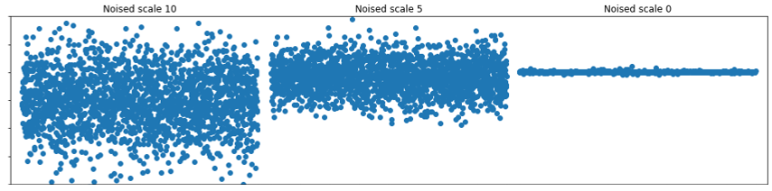

# Introduction to Diffusion models

This repository provides an introduction to Diffusion models with simple examples in pytorch.
There are already many good resources explaining how diffusion models work, such as [Lilian Weng's blog post](https://lilianweng.github.io/posts/2021-07-11-diffusion-models/) or even [Wikipedia](https://en.wikipedia.org/wiki/Diffusion_model).
However, having a basic understanding of how diffusion works is not enough to code them.
Most available diffusion models are aimed at generating images and hence are very complex.
Here we will code a simple diffusion model in just 100 lines of python code.

## What are diffusion models?

Diffusion models belong to the class of generative models as they can create new content and are very performant at image generation.

We train a neural network to remove some level of noise from the data

We will focus on the implementation of ["Denoising Diffusion Probabilistic Models"](https://proceedings.neurips.cc/paper/2020/file/4c5bcfec8584af0d967f1ab10179ca4b-Paper.pdf) (DDPM).

## How to implement a diffusion model in 100 lines of python?

To code neural networks, we will use Pytorch.
In our first implementation, the only libraries needed are [torch](https://pytorch.org/) for the neural networks, [matplotlib](https://matplotlib.org/) for plotting our results, and [numpy](https://numpy.org/) for the calculations.

We will code `single_DDPM.py` which can be found in the `codes` folder.

## Diffusion models in 2D

Now that we have coded DDPM in 1D, we can scale it up to 2D with minimal changes.

## Diffusion models in 2D with multimodalities

Diffusion models are supposed to be very expressive, allowing them to capture multimodalities present in the initial data.
We will illustrate this point in the following example. The initial distribution of the data is the sum of 4 narrow Gaussians with spikes in (-1, -1), (-1, 1), (1, -1) and (1, 1).
As before, we will add noise until this initial distribution is indistinguishable from a Gaussian centered at the origin with std 1.
The denoising process should then separate the data into the four spikes as illustrated on the gif below.

